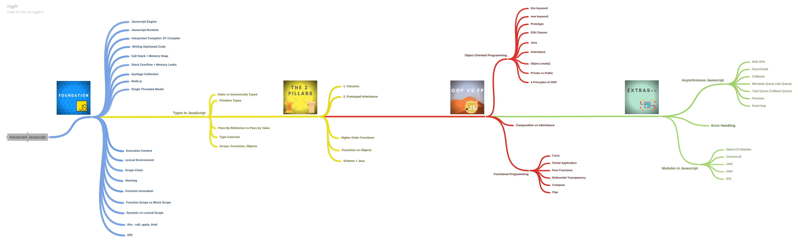

# Advanced-js
A complete  Modern JavaScript Tutorial from scratch

# 1. Foundations
# 1.1 Inside the Engine

## Components

**parser**,
**interpreter**,
**compiler**,
**abstract syntax tree (AST)**,
**call stack**,
**memory heap**

## First engine

The first JavaScript engine was created by Brendan Eich(Creator of JS). This evolved into the SpiderMonkey engine, still used by the Firefox browser.
while chrome usses Chrome V8 engine

## Flow of a JS-engine:

Parser => AST => Interpreter
	(1) => Bytecode (01010110011)
	(2) => Profiler ==> Compiler ==> Optimized code (100110011010)

**Interpreter**: line by line; from left to right and top to bottom

**Compiler**: code optimizations: first look at the code for optimizations

**JIT (Just In Time) Compiler**: combination of compiler and interpreter.

All Modern JS Engine uses JIT Compilers
# 1.2 Callstack & Memory Heap

## Memory heap

Storage for values ​​(functions, variables) in a prepared space in the working memory (RAM).

## Callstack

In an execution context called functions get added on top of the callstack. Once the interpreter leaves the function through a return or otherwise the function reference gets popped of the callstack.

The values and functions that are in the memory heap are referenced in the callstack.

There is only one callstack, i.e. "single threaded" and "synchronous" JS 

A new thread creates a new callstack

## Stack Overflow

Functions calling themselves or functions being called in a never ending loop.

These days the error "maximum stack size reached"

# 1.3 Garbage Collection

Only the data that is still useful to us remains in the Memory Heap to make sure to not use up all the memory available.

## False sense of security

Automatic garbage collection creates a false sense of safety. Programmers should think about how their programs affect the memory usage.

Memory leaks might still happen with automatic garbage collection. No system is perfect and garbage collectors can only do so much.

It's easy to create a memory leak:

```
let array = [];

for (let i = 0; i > 1; i++) {
	array.push(i-1);
}
```

Risky patterns that may create memory leaks:

- Global variables (keep sitting in memory and might get bigger and bigger)
- Event listeners (should be removed)
- setInterval (objects references inside intervals will never be cleared in memory because the interval runs forever)

# 1.4 Event Loop, Call Stack en Callback Queue

## Event Loop

Continually checking if the **call stack** is empty. Runs functions and sends calls to the appropriate destinations such as the external Web API.

## Call Stack

*Synchronous* functions get added to the call stack.

## Web API

*Asynchronous* functions like setTimeout use the Web API. Their logic is handled "over there" in a separate thread. They return a **callback** which goes to the **callback queue**.

## Callback Queue

Asynchronous callbacks arrive in the callback queue. They are picked up by the **event loop** and send back to the **call stack** *IF* it is empty and the synchronous functions (i.e. execition contexts) have finished running.

# 1.5 Node.js

Node.js is a **runtime**: 
it is an engine (V8), an asycnhronous API and tooling to work with a file and operating system.
## Runtime

Software that is executed while a program is running.
Runtime code is the code required to implement the features of the language itself.

Google Chrome's V8 engine is a runtime that compiles JavaScript to machine code.

Low level languages tend to have no or very small runtimes. Higher level programming languages often have runtimes. Java ("write once, run anywhere") is a famous example: Java Runtime Environment (JRE).

# 1.6 Execution Context

Each function call creates a new **execution context**.

Each execution context is added to the Call Stack. Each function or variable has access to its execution context.

There is always a **global** execution context. So there is always an execution context

# 1.7 Lexical environment

Lexical environment: where code is written (global or inside a function).

**Execution context** tells you which **lexical environment** is currently running.

## Lexical scope

Lexical scope is the **available data** (execution context and memory heap) + **variables where the function was defined** (lexical environment).

This determines our available variables and _not_ where the function is called (dynamic scope).

If a function is written inside another function you have a function lexical environment. The outer function is the **function lexical environment** for the inner function.

## Function lexical environment

If a function is written inside another function you have a function lexical environment. The outer function is the **function lexical environment** for the inner function.

# 1.8 Function scope vs Block scope

Originally JavaScript is only functionally scoped and not block scoped. This means that variables inside functions are private, but variables inside code blocks `{}` such as with if/else-statements are not scoped. Values in such blocks can be accessed.

Most languages do have block scoping.

Because JS was weird in that sense they introduced the `let` and `const` keywords in ECMAScript 6. Variables declared with these keywords are block scoped.

# 1.9 Global variables

Try to avoid them as much as possible. ;-)

# 1.10 `this`

Do you know what *this* is?

**this** is the object that the function is a property of.

`this` basically answers the question: **"what called me?"**

Global functions are a property of the global object. On the web that is `window`.

For methods, functions sitting on objects, *this* refers to those objects that they are a method of.

`this` then refers to what is left of the "." in method calls.

When calling `Person.sayName()` `this` refers to "Person".

When calling `helloWorld()` in the global lexical scope, `this` refers to the global scope such as the Window object in browsers. You could also have written `window.helloWorld()`.

## `this` and dynamic scope vs lexical scope

It's about the calling context (**dynamic scope**) and _NOT_ the lexical scope.

"In JavaScript our lexical scope (available data + variables where the function was defined) determines our available variables. Not where the function is called (dynamic scope)."

```
// Helper function
const isSingular = (number) => {
		return number === 0 || number === 1;
};

const Person = {
		name: null,
		age: null,
		sayName() {
			return this.name;
		},
		sayAge() {
			return this.age;
		},
		sayNameAndAge() {
				return `My name is ${this.sayName} and I am ${this.sayAge} year${isSingular(this.sayAge) ? "" : "s"} old.`;
		},
};

const ruben = { ...Person, name: "Ruben", age: 33 };
```
# 1.11 call(), apply(), bind()

## `call()`

Under the hood all functions use `call()` when they run. Every function gets this method attached to it.

## `apply()`

`apply()` does the same thing as `call()`.

## `call(obj, args...)` and `apply(obj, [args...])`

With call and apply you can borrow methods from other objects and "apply" them to an object that does not have that method. You can also pass in extra parameters.

## `bind()`

Also allows us to use other object's methods, but with the difference that bind returns a new function. It basically copies it for later use without calling the function immediately. 

## bind() and currying

WIth `.bind()` you can extend any function through currying (passing function into functions).

```
function multiply(a, b) {
	return a * b;
}

let multiplyByTwo = multiply.bind(this, 2);
let multiplyByTen = multiply.bind(this, 10);

console.log(multiplyByTwo(4)); // 8
console.log(multiplyByTen(4)); // 40
```

# 2. Types
# 2.1 Six and a half types ...and "function"

There are 6 data types in JavaScript... or actually 7... wait, no! There are six! Huh!? Whaaa!

## Primitive types

Represent single values. Easy and simply.

1. `number` like 5

2. `string` like "Hello world!"

3. `undefined` when something lacks a definition. Variables that are hoisted or defined without assignment are assigned "undefined".

4. `null` doesn't actually exist as a type, but is an "object". This is one of the quirks of JS.

5. `symbol` for unique object properties


##  Non-primitive types

Can combine multiple types. Do not actually contain the value directly, but is a reference (pointer) to some place in memory.

6. `object` for objects, arrays, functions and... null

7. `function` is not actually a real type because it is actually an object.

- Arrays are `object`s

So up to number five it all makes sense, but then it gets weird. `null` is an object while it shouldn't be. Functions have the type of `function` while they should be `object`s.

# 2.2 Pass by reference vs pass by value

## Passed by value

Primitives are **passed by value**.

There is no link back to memory, but bascially you are dealing with a copy of the original. Changing these values does not affect the original, but the copy.

## Passed by reference

Objects are **passed by reference**.

When objects are passed into a function they still point to the original place in memory. Making changes to the object that are passed into functions changes the original.

## Cloning objects

How can we create copies of objects and not references?

### Shallow cloning

Clone one object, but not child objects.

```
const obj = {
	a: 1,
	b: 2,
	c: {
		deep: "Try and copy me"
	}
};

let clone1 = Object.assign({}, obj);
let clone2 = { ...obj };
```

### Deep cloning

Clone an object and all objects within it.

Below is not a good idea generally, because with massive objects it can take a long time and increased memory consumption. There are better ways of solve problems around objects passed by reference.

```
const obj = {
	a: 1,
	b: 2,
	c: {
		deep: "Try and copy me"
	}
};

let deepClone = JSON.parse(JSON.stringify(obj)); 
```
# 2.3 Coercion

A very controversial topic.

Operators like `==`, `+` result in coercion. Better avoid generally.

# 3 Two Pillars
# 3.1 Functions: First Class Citizens

Functions are data.

Functions are `object`s.

They can be **passed** around in other functions and **returned** by other functions.

They can be stored inside variables (**function expressions**).

Anything you can do with any other type you can do with functions.

This opens up exciting possibilities for **functional programming**.

# 3.2 Higher Order Functions (HOF)

_Don't hassle the Hoff!_

## Powerful and an easy definition

```
function() < function(a,b) < HOF
```

A **Higher Order Function** (HOF) is a function that takes a **function as an argument** or **returns a function**.

## But why are HOF's useful and how to use them properly?

Yeah?


# 3.3 Pillar 1: Closures

Variables in the **variable environment** of an **execution context** of a **higher order function**, i.e. a function that returns a function, are stored in a special box, "**the closure**". These variables are **not collected** by the **garbage collector**.

That all this can happen is thanks to the concept of the **lexical environment** which is checked by the JIT Compiler before executing any code. It sees that there are variables in functions bodies (soon to be execution contexts) that will be referenced later by "lower order" functions.

## Closures are sometimes referred to as "lexical scoping"

**lexical** = where the code is written.
**scope** = what variables the JIT compiler/runtime has access to.

In execution contexts you do not only have access to variables higher in the calling context, but also what is stored in the memory heap through closures.

**Lexical environment === [[scope]]**

Where we write the function matters. Not where we call/invoke the function.
excode: https://repl.it/repls/GlaringLovingCables 
## Closures & Encapsulation

## Principle of least privilege

Data safety when making API's or other code that is accessibily to the public. With closures you can keep data safe for internal reasons.
Code: https://repl.it/repls/ExhaustedDisgustingSet

# 3.4 Pillar 2: Prototypal Inheritance

Almost everything in JavaScript is an object. All objects inherit from other objects until all the way up to the **prototype chain** the base `Object`.

`__proto__` can be used to extend objects to protypal objects, but should never be used!

`.isPrototypeOf(Object)` checks if passed the object it is called upon (`this`) is a prototype of the passed in object.

`.hasOwnProperty`: checks if a given property is on the object it is called upon. There is, in other words, no need to go up the prototype chain.

Make one object inherit from another object:

```
const lizard = {
	strength: 10,
	health: 100,
	attack() {
		return this.strength;
	},
	battleCry() {
		return `Broaoa!`;
	},
}

const dragon = {
	strength: 50,
	health: 200,
};

dragon.__proto__ = lizard;
```

`lizard.isPrototypeOf(dragon) === true`


# 3 OOPS
# 3.1 Factory functions

Factory functions are functions that create objects with arguments passed into them. Each new object created this way can share properties and methods, but can also have it's own unique properties and methods.

```
function createElf(name, weapon) {
	return {
		name,
		weapon,
		attack() {
			return `${this.name} attacks with ${this.weapon}`;
		}
	};
}

const legolas = createElf("Legolas", "silver bow");
const marwin = createElf("Marwin", "dual swords");

console.log(legolas.attack());
console.log(marwin.attack());
```

Although above code is DRY there is a downside: for each new elf a new object is created and stored at a new address in memory. Each object has it's own properties and methods.

CodeEx: https://repl.it/repls/PlainPrudentPercent

# 3.2 `Object.create()`

`Object.create()` creates a link between two objects. It creates a prototype chain: (`derivedObject.__proto__ === originObject`)

```
// Factory function using Object.create() for efficient memory usage.
const elfMethods = {
  attack() {
    return `${this.name} attacks with ${this.weapon}.`;
  },
  battleCry() {
    return `${this.name}: "For ${this.kingdom}!"`;
  },
};

// The factory function.
function createElf(name, kingdom, weapon) {
  let newElf = Object.create(elfMethods);
  
  newElf.name = name;
  newElf.kingdom = kingdom;
  newElf.weapon = weapon;
  
  return newElf;
}

const legolas = createElf("Legolas", "Dark Woods", "silver bow");
const arwen = createElf("Arwen", "Ravendale", "moon lance");

console.log(legolas.battleCry());
console.log(legolas.attack());
console.log(arwen.battleCry());
console.log(arwen.attack());
```
# 3.3 Constructor functions

The `new` keyword used before calling a constructor function creates a new object with all the properties and methods defined in the constructor function. It also creates a new execution context with newly bound `this` and `arguments` keywords.

CodePen: https://repl.it/repls/PrivateQuickRecursion

# 3.4 ES6 `class` keyword

```
// "Class" for Pseudo-Classical Inheritance
class Elf {
  constructor(name, kingdom, weapon) {
    this.name = name;
    this.kingdom = kingdom;
    this.weapon = weapon; 
  }

  // Do not add methods inside the constructor because that
  // gets run everytime a new object is instantiated.
  attack() {
      return `${this.name} attacks with ${this.weapon}.`;
  };

  battleCry() {
    return `${this.name}: "For ${this.kingdom}!"`;
  }
}

// Instantiate new objects.
const legolas = new Elf("Legolas", "Dark Woods", "silver bow");
const arwen = new Elf("Arwen", "Ravendale", "moon lance");

// Is legolas an istance of Elf?
console.log(`Is legolas an istance of Elf? ${legolas instanceof Elf}`);

console.log(legolas.battleCry());
console.log(legolas.attack());

console.log(arwen.battleCry());
console.log(arwen.attack());
```
# 3.5 Four ways to bind `this`

```
// (1) With the `new` keyword
function Person(name, age) {
  this.name = name;
  this.age = age;
  this.sayHi = function () {
    return `Hi, I'm ${this.name}.`;
  };
}

const dave = new Person("Dave", 24);

console.log(dave.sayHi());

// (2) Implicit binding
const charlotte = {
  name: "Charlotte",
  age: 35,
  sayHi() {
    return `Hi, I'm ${this.name}.`;
  },
};

console.log(charlotte.sayHi());

// (3) Explicit binding
const karin = {
  name: "Karin",
  age: 48,
  
  // Below function with timeout returns "2"... lol?
  sayHi: function () {
    return `Hi, I'm ${this.setTimeout(() => this.name, 500)}.`;
  }.bind(window),
};

console.log(karin.sayHi());

// (4) Arrow function
const aris = {
  name: "Aris",
  age: 59,
  sayHi: function () {
    var inner = () => {
      return `Hi, I'm ${this.name}.`;
    };
    
    return inner();
  },
};

console.log(aris.sayHi());
```
# 3.6 OOP and Inheritance

With the `extend` and `super` keywords you can extend classes created with the `class` keyword.

It's the core of the Classical Object Oriented paradigm. It adds inheritance. In the case of JavaScript it creates a Prototypal Inhertiance.

```
// Base Character class
class Character {
  constructor (name, allegiance, weapon) {
    this.name = name;
    this.allegiance = allegiance;
    this.weapon = weapon;
  }
  
  attack () {
    return `${this.name} attacks with ${this.weapon ? this.weapon : "fists"}.`;
  }
  
  battleCry () {
    return `${this.name}: "For ${this.allegiance}! Charge!!"`;
  }
}

// Elf class that exends the Character class
class Elf extends Character {
  constructor (name, allegiance, weapon, type) {
    super (name, allegiance, weapon);
    
    this.type = type;
  }
}

const doby = new Elf("Doby", "House of Fallstar", "Aspen Bow", "elf");

console.log(doby.battleCry());
console.log(doby.attack());
```
# 3.7 Four Pillars of OOP

1. Encapsulation ("class packages")
2. Abstraction ("hiding complexity for the user")
3. Inheritance ("DRY and safe memory space")
4. Polymorphism ("many forms")

# 4 Functional programming

**Function programming** is all about **separation of concerns**: separating data and function.

FP generally has a preference for simplicity and single purpose. Functions do one thing very well.

Above is in essence a **pure function**:

- Given the same input you always get the same output;
- There are no side effects.

The first principle is also called **referential transparency**.

# 4.1 Pure functions

A **pure function** has the following characteristics:

- Given the same input you always get the same output;
- There are no side effects.

The first principle is also called **referential transparency** or **idempotency**.

Not everthing can be pure in the philosophical sense that something pure will not do anything: there is no affect on the outside world. Somewhere, somehow you want/need to have side effects in order to change something in the "outside world".

The idea of pure functions is however that you minimize and cluster the area's where your code has side effects and is thus "tightly coupled" with data and views.

# 4.2 Idempotence

Given the same input a functions always return the same output.

Functions with `Math.random()` can never be idempotent for example.

Also deleting an entry from a database cannot be idempotent, because you can not delete the same entry again. The function will not give the same result.

# 4.3 Imperative vs Declarative

Imperative: step for step instructions.

Declarative: just say what needs to happen (lower level code takes care of the rest)

So imperative is more related to lower level code. Declarative is more related to higher level code.

# 4.4 Immutability

The principle to only mutate state when absolutely necessary. Most of the time it would be better to clone or return something new.

This could be memory inefficient at scale. That is why with FP architects ofthen choose to do **structural sharing**: only clone the parts of the data that have changed.

Next to do that memory is cheap these days, so using a bit more memory with the great benefits is not a bad tradeoff.

# 4.5 HOF & Closures

Example of higher order function:

```
const hof = (fn) => fn(5);
hof(function a(x) { return x });
```

Functions as first class citizens can be passed around and returned by functions.

```
const closureFunction = function() {
	let count = 0;

	return function increment() {
		count++;

		return count;
	}
}

const incrementFn = closureFunction();

incrementFn();
```
# 4.6 Currying

Example of currying:

```
// Not curried:
const multiply = (a, b) => a * b;

// Curried
const curriedMultiply = a => b => a * b;


multiply(5, 3); // 15;
curriedMultiply(5)(3); // 15;
```

With currying functions have only one parameter can be be combined (**composed**) into new functions. You are basically creating functions on the fly.

# 4.7 Partial application

Like currying the aim is to have less parameters: some parameters are passed in initially, but are stored with closures for later use.

```
const multiply = (a, b, c) => a * b * c;
const partialMultiplyBy5 = multiply.bind(null, 5);

partialMultiplyBy5(4, 10); // 200
```

# 4.8 Memoization

A form of caching data: the returned values of functions are cached.

Example:
```
function memoizedAddTo80() {
	let cache = {};

	return function (n) {
		if (n in cache) {
			return cache[n];
		} else {
			cache[n] = n + 80;

			return cache[n];
		}
	}
}

const memoized = memoizedAddTo80();

// First call is calculated and the return is cached.
console.log("1", memoized(5));

// Second call retrieved from cache.
console.log("2", memoized(5));
```
# 4.9 Compose & Pipe

## Compose

**Composition** is the idea that any kind of data transformation should be obvious.

Or: composability is a system design principle that deals with the relationship between components.

```
const compose = (f, g) => (data) => f(g(data));
const multiplyBy3 = (num) => num * 3;
const multiplyBy3AndAbsolute = compose(multiplyBy3, Math.abs());

console.log(multiplyBy3AndAbsolute(-50));
```

## Pipe

"Performs left-to-right function composition. The leftmost function may have any arity*; the remaining functions must be unary."

It is very similar to compose, but the direction is left-to-right.

```
const pipe = (f, g) => (data) => g(f(data));
const multiplyBy3 = (num) => num * 3;
const multiplyBy3AndAbsolute = pipe(multiplyBy3, Math.abs());

console.log(multiplyBy3AndAbsolute(-50));
```

## *: Arity

The number of functions that are conposed or piped together.


# 5 Asynchronous
**Asynchronous** means: we do not have it right now, but maybe later.

# 5.1 Promises

Promises are handy for asynchronous (non-blocking) code like

- making API calls,
- grabbing data from a database, or
- optimizing an image.

## Definition

A Promise is an **object** that may return a single value in the future that is either **resolved** or **rejected** (and a reason why it was rejected).

A promise may be in one of three possible states: **fulfilled**, **rejected** or **pending**.

## Combine multiple Promises

```
const promise = new Promise((resolve, reject) => {
	setTimeout(resolve, 0, 'Resolved after 0 seconds.');
});

const promise = new Promise((resolve, reject) => {
	setTimeout(resolve, 2000, 'Resolved after 2 seconds.');
});

const promise = new Promise((resolve, reject) => {
	setTimeout(resolve, 5000, 'Resolved after 5 seconds.');
});

Promise.all([promise, promise2, promise3]).then(values => console.log(values));

// Result: Array with the return values from all promises after 5 seconds.
// Due to `.all()` we have to wait for the last promise to resolve.
```

## Fetch data from JSON's (API calls)

```
const urls = [
	"https://jsonplaceholder.typicode.com/users",
	"https://jsonplaceholder.typicode.com/posts",
	"https://jsonplaceholder.typicode.com/albums",
];

Promise.all(urls.map(url => {
	return fetch(url).then(resp => resp.json())
})).then(results => {
	console.log(results[0]);
	console.log(results[1]);
	console.log(results[2]);
}).catch(() => console.error(error));
```

# 5.2 Async / Await

With EcmaScript 2015 (ES6) `async / await` was introduced which is build on top of Promises.

# 5.3 Job Queue

In order to introduce promises there had to be some modifications to JavaScript engines or how the **Event Loop** worked.

Next to the **Callback Queue** (also known as the **Task Queue**) there had to be another queue: this became the **Job Queue** (or: **Microtask Queue**).

The Job Queue has a higher priority than the Callback Queue because the Event Loop always checks that one first en then the callback queue.

# 5.4 Parallel, Sequence and Race

## Parallel: `.all()`

Create **parallel** promises that returns once all promises have been fulfilled. The promises are all called at the same time (in parallel).

## Race: `.race()`

The first promise in a set/array that returns something wins.

## Sequence `await` each promise

In sequences each promise cannot be called until the previous one has been fulfilled. Therefore it would take longer than parallel if they call the same promises.

# 5.5 web worker
web worker is a javascript program running on a different thread alongside

our main threat just like a browser creates a new threat for us when I create new tabs on our program.

```
var worker = new Worker("worker.js");

worker.postMessage("Hello!");
```
